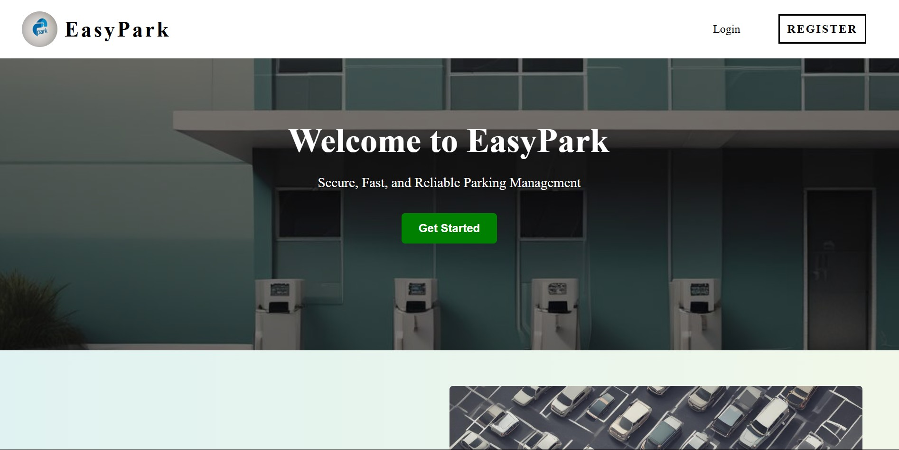
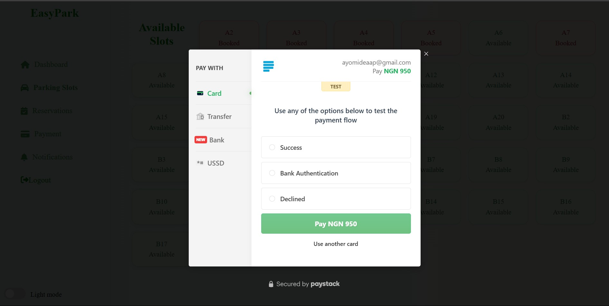
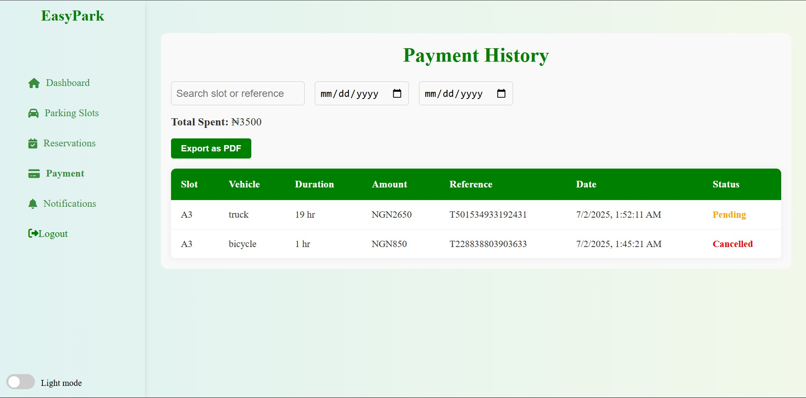

# 🚗 EasyPark - Frontend


[](https://easy-park-frontend-aderinto-ayomides-projects.vercel.app)
[]
[](https://opensource.org/licenses/MIT)

> 🎯 A user-focused Parking Management System frontend built with React. Allows real-time parking slot bookings, payment via Paystack, history tracking, and more.

---

## 🌍 Live Preview

🔗 [EasyPark](https://easy-park-frontend-aderinto-ayomides-projects.vercel.app)

---

## 📸 Screenshots


### 🔐 Landing page



### 📊 User Dashboard


### 💳 Booking Modal (Paystack)


### 🧾 Payment History



## ⚙️ Tech Stack

- ⚛️ React (CRA)
- 🎨 Custom CSS
- 💳 Paystack (via `react-paystack`)
- 🔒 LocalStorage (for tokens)
- 🛰️ API Integrated via Fetch
- 📲 Mobile Responsive
- 🚀 Hosted on [Vercel](https://vercel.com)

---

---

## 🧠 Key Features

- ✅ User registration and login
- ✅ Token-based authentication
- ✅ Real-time slot availability display
- ✅ Booking modal with Paystack integration
- ✅ Booking cancellation & history tracking
- ✅ Billing summary + search + pagination
- ✅ Notification system with read/unread
- ✅ Mobile responsive layout
- ✅ Admin dashboard (coming soon 🚧)

---
## 🙌 Acknowledgements
[built from scratch by @ayomide-23](https://github.com/ayomde-23) 

## 🛠️ How To Run Locally

1. **Clone the repo**
```bash
git clone https://github.com/ayomide-23/EasyPark-frontend.git
cd EasyPark-frontend
```
2. **Install dependencies**
   ```bash
   npm install
   ```
3. **Set environment variable**
   ```bash
   REACT_APP_PAYSTACK_PUBLIC_KEY=your_public_key_here
   ```
5. **Start the sever**
   ```bash
   npm start
   ```
